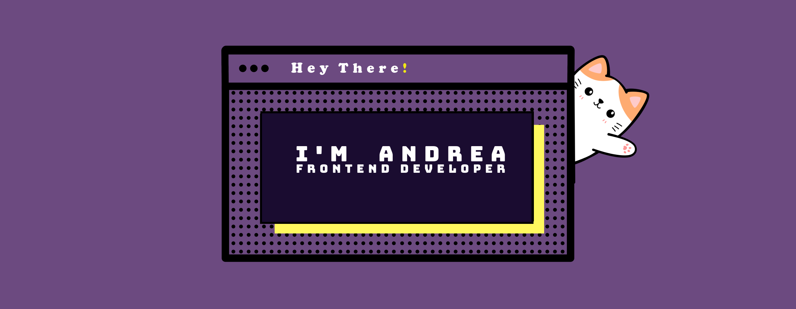

###

<table>
  <tr>
  <td width="70%">
<h2 align="left">🤓 Who am I?</h2>

I'm Andrea Larsen, a Full stack developer with a passion for Frontend Developement and user experience. After the pandemic, I decided to take a new direction in life.  
I had been working in the food industry as a pastry cook for several years, but during that time, I discovered a growing interest in technology and design. That led me to pursue a diploma in <strong>Multimedia Design and Development</strong> at Humber College, which I proudly completed last year. 🎓  

While studying, I found myself drawn more and more to <strong>web development</strong>, and eventually joined an intensive <strong>Full Stack Web Development Bootcamp</strong> to deepen my skills. 🚀  

At one point, I felt unsure if I could succeed in this new path, I loved UX/UI design, but I wasn’t yet confident in my coding skills. So I took a much-needed trip back to Argentina 🇦🇷 (after 6 years away!) to recharge, reflect, and reconnect with my goals.  

When I returned, I joined the <strong>Henry Bootcamp</strong>, fully committing to becoming a developer, and I haven’t looked back since. 💻✨

</td>
<td align="center" width="30%">

  

</td>
</tr>
</table>

###
  
###
<h2 align="left">💫 My Goal</h2>

My goal is to keep learning new tools and technologies, grow as a developer, and deepen my understanding of user experience. 🎯 

I’d love to start sharing what I learn, whether it’s through writing Medium posts, creating small tutorials, or giving tips that can help others. 💡

My long-term dream is to become a <strong>Software Product Engineer</strong>, someone who bridges the gap between design and development. 🎨🧑‍💻

I know it will take a lot of work, but I’m excited and ready to take on that journey. 🚀

###
  
###
<h2 align="left">🌱 Currently Learning:</h2> 
TypeScript • Next.js • Tailwind CSS • PostgreSQL

###
  
<h2 align="left">💻 My Latest Project</h2>

<a href="https://www.smart-qr.tech/" target="_blank">🌐 smart-qr.tech</a>

Learn more about this full-stack group project on my <a href="https://www.linkedin.com/in/andreablarsen/" target="_blank">LinkedIn</a>, in the Projects section.

###

  
<h2 align="left">🚀 My Tech Stack:</h2>

###

  
  
  
  
  
  
  
  
  
  
  
  
  
  
  
  
  
  
  
  
  
  
  
  
  
  
  
  
  
  
  
  
  
  
  
  
  

###

<picture>
  <source media="(prefers-color-scheme: dark)" srcset="https://raw.githubusercontent.com/AnBLarsen/AnBLarsen/output/github-snake-dark.svg" />
  <source media="(prefers-color-scheme: light)" srcset="https://raw.githubusercontent.com/AnBLarsen/AnBLarsen/output/github-snake.svg" />
  
</picture>

###

  
  

###

