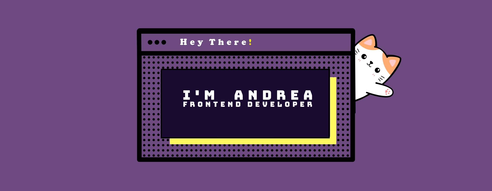

###

<table>
  <tr>
  <td width="70%">
<h2 align="left">👩‍💻 Who am I?</h2>

I’m a Frontend Developer and UX Engineer focused on building user-centered, accessible web applications with React, Next.js, TypeScript, Tailwind CSS, and Figma.

In my first tech role as a Junior UX Software Engineer, I contributed to customer-facing applications, user portal functionality, authentication flows, online booking, service recommendation experiences, frontend testing, analytics, monitoring, and cloud-based workflows.

My background combines UX/UI design, frontend development, accessibility, and customer experience. I’m currently expanding into full-stack development through NestJS, API design, Swagger, PostgreSQL, authentication, testing, and deployment.

</td>
<td align="center" width="30%">

  

</td>
</tr>
</table>

###
<h2 align="left">💫 What’s Next</h2>

I’m currently strengthening my backend skills with NestJS, REST API design, Swagger, PostgreSQL, authentication, testing, and deployment.

My goal is to grow as a frontend-first full-stack developer who can design and build complete, accessible, production-ready web applications.

###

###
<h2 align="left">🤓 Currently Learning:</h2> 
NestJS · REST API Design · Swagger/OpenAPI · PostgreSQL · Backend Authentication · Testing · Deployment

###

<h2 align="left">💻 My Latest Project</h2>

### SmartQR — Self-Ordering Web App

A mobile-first QR ordering platform that allows customers to browse menus, place orders, and complete payment flows.

**Role:** Frontend Developer & UI/UX Designer  
**Tech:** React · TypeScript · Auth0 · Figma · React Context · localStorage  

<a href="https://www.smart-qr.tech/" target="_blank">🌐 smart-qr.tech</a>

<a href="https://github.com/SmartQrProject/SmartQr-Front" target="_blank">📁 smart-qr.tech</a>

Learn more about this full-stack group project on my <a href="https://www.linkedin.com/in/andreablarsen/" target="_blank">LinkedIn</a>, in the Projects section.

###

<h2 align="left">🚀 My Tech Stack:</h2>

###

  
  

  
  

  
  

  
  

  
  

  
  

  
  

  
  

  
  

  
  

  
  

  
  

  
  

  
  

  
  

  
  

  
  

  
  

  
  

  
  

  
  

  
  

  
  

  
  

  
  

  
  

  
  

  
  

  

###

<picture>
  <source media="(prefers-color-scheme: dark)" srcset="https://raw.githubusercontent.com/AnBLarsen/AnBLarsen/output/github-snake-dark.svg" />
  <source media="(prefers-color-scheme: light)" srcset="https://raw.githubusercontent.com/AnBLarsen/AnBLarsen/output/github-snake.svg" />
  
</picture>

###

  
  

###

